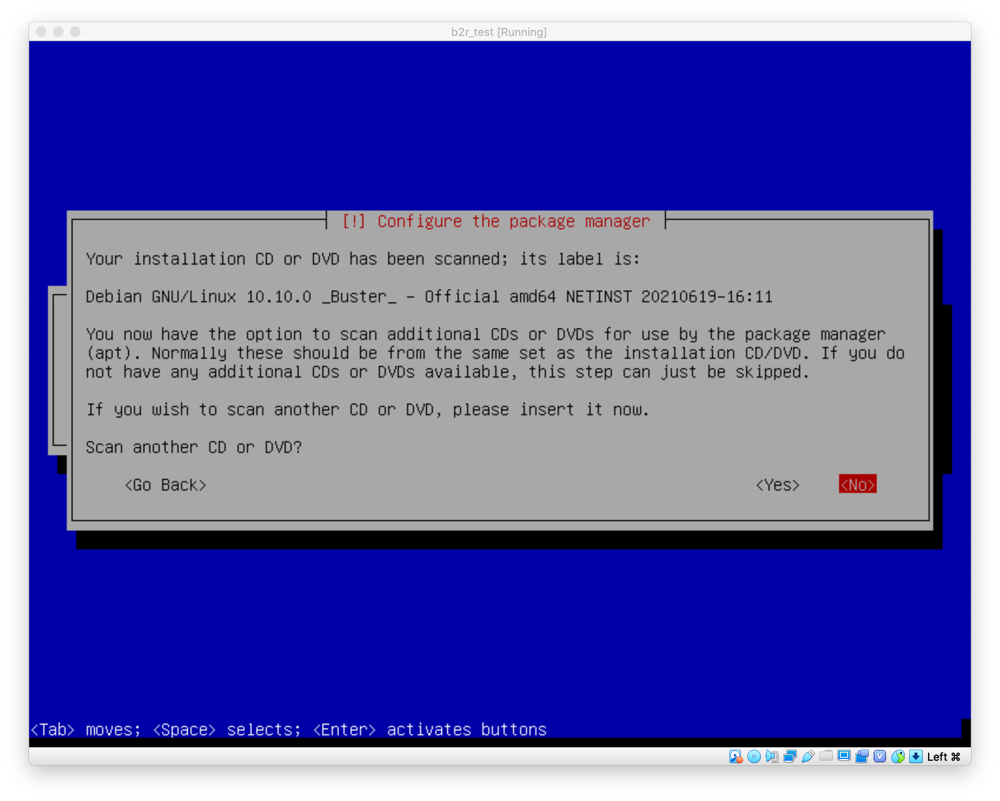

# 설치가이드

### Virtual Box 설치 및 debian 설치

- launchpad에 virtualbox가 없을 경우 새로 설치해야 한다.
    1. managed software center에서 virtualbox 검색 및 install
    2. update 탭에서 update를 해야 설치가 완료됨.

- debian을 설치해야 한다.
    1. 2021. 09. 12. 기준 현재 stable 버전은 11.0
    2. `10번대 버전`을 사용해야 정상작동 된다.
    3. 아래 링크에서 알맞은 버전을 선택하면 된다.
    `버전 폴더` → 알맞은 cpu (클러스터는 `amd64`) → `iso cd` → `debian ver cpu netist iso`

    [데비안 설치페이지](http://cdimage.debian.org/cdimage/archive/)

    

---

- new를 통해 새 가상환경 설치

---

- 이름과 경로, 타입과 버전을 입력한다.
    1. name
    생성될 폴더의 이름
    2. 경로 
    "그 곳"의 경로 입력 ("그 곳"의 경로로 설정해야 용량 문제가 일어나지 않는다.)
    3. 타입, 버전
    리눅스와 데비안 입력

---

- 차례대로 설정한다.
    1. 1024MB (가상머신에서 사용할 메모리 크기)
    2. Create a Virtual hard disk now (가상디스크 파일을 만들게 됨)
    3. VDI (virtualbox 에서만 사용가능한 포맷)

    VDI
    가상머신 핵심파일로 다른 파일 없이도 현재 상태의 가상머신을 살릴 수 있음.
    다른 pc로 이동하여 사용할 때 파일 하나만 가지고 가면 됨.

    VHD
    virtualbox, hyper-x, xen에서 구동가능한 포맷방식

    VMDK
    virtualbox, VMware에서 구동가능한 포맷방식

    1. Dynamically allocated (저장공간이 동적으로 설정되어 공간효율에 좋음, 성능은 떨어짐)
    2. 8.0GB (저장공간의 한계치)

---

- start를 눌러 시작.

- 경로에 아까 다운로드 받은 debian iso 파일 설정.

처음에 창이  굉장히 작다.
상태바의 view → virtual screen1 → 275% 설정하면 된다.

---

- 2번째 `Install` 엔터

- 언어는 `English`로 선택한다. Korean은 글자가 깨지는 이슈가 있을 수 있다.

    

- 국가는 `other` → `Asia` → `Korea, Republic of`로 선택한다. ~~북한주민이 되지 않게 조심하자.~~

    

- `United States`로 선택한다.

    

- 키보드는 `Korean`으로 설정한다.

    

- 호스트네임을 설정해야 한다.
서브젝트에서 요구하는대로 입력한다.

    

- 빈칸으로 넘어간다.

    

- 호스트네임의 비밀번호를 설정한다.
두번 입력해야 한다.

    

- 해당 가상머신으로 작업할 때 사용할 계정의 이름, ID, 암호를 설정한다.
서브젝트에서 요구하는대로 입력한다.

    

- 다음으로 넘어가면 앞서 적은 user이름이 자동으로 적혀있다. (이름 ⇒ ID 같이 가려는 듯)
continue로 넘어가도록 한다.

    

- 서브젝트에서 요구하는데로 `암호화된 LVM`을 선택한다.

    

- 다음

    

- 파티션을 분할해야 하니 `Separate ...` 선택

    

- LVM 구성하시겠습니까?  → yes
기존 드라이브를 LVM으로 분할하여 사용함을 선택하는 것 같다.
++ 드라이브 덮어쓰기 물어보는 듯 함.

    

- 암호화LVM에 대한 비밀번호를 설정한다.

    

- 기존 8.1GB 그대로 선택한다.
LVM 분할 할 볼륨의 크기를 묻는 것 같다. 전체 용량 선택

    

- 끝내기

    

- 디스크 덮어쓰기 전 확인, `Yes` 선택

    

- 더 읽을 파일은 없으니 `no` 선택

    

- `대한민국 선택`
update, upgrade, 프로그램 추가를 위한 네트워크 미러 사이트 설정.

    

    

- 프록시 설정이 필요한 경우 선택, 우리는 그냥 `enter`를 눌러 진행

    

- 통계자료 보내기, `no` 클릭

    

- ISO파일에는 핵심부분만 설치되어 있다. 
추가로 설치할 소프트웨어를 선택할 수 있다.
기본으로 아래 두 파일이 선택되어있으니 그냥 `enter`

    

- `no`를 선택하여 GRUB를 설치 X
GRUB의 경우 
1) 서브젝트에 명시되어 있지 않은 점
2) 평가 항목에 있어 영향을 끼치지 않는 점
에서 설치를 하든 안하든 상관 없는 것으로 보임.

    단, 요즘엔 잘 사용하지 않는 편.

    

- 서브젝트에 명시된 부트 경로 지정을 위해 `manually` 설정

    

- 서브젝트에서 명시된 경로 지정

    

- 설치 완료

    

- 해당 화면이 나오면 정상적으로 설치가 완료된 것이다.

    