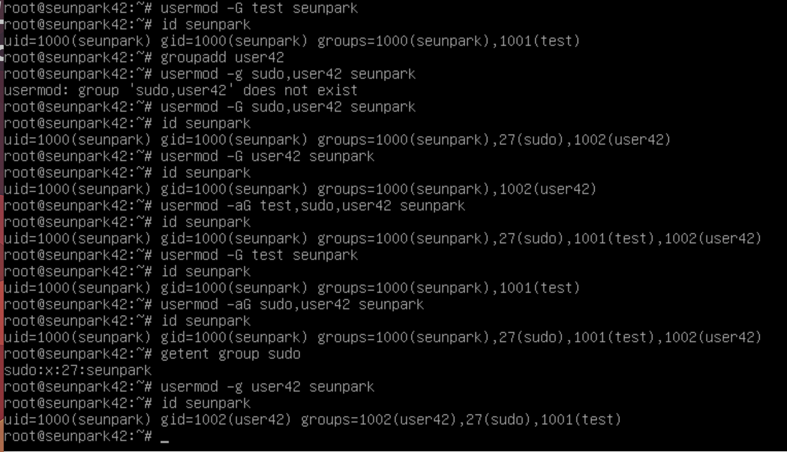

# sudo적용 / 그룹설정

생성일: 2021년 9월 13일 오후 8:53

>sudo 설정 등 설정 후에 명령어가 먹지 않는다면, 로그아웃 후 재 로그인하여 실행

### sudo 설치 및 설정

---

- `su -` 명령어를 통해 root 계정으로 이동.

- sudo가 설치되어있는지 여부 확인.
`dpkg -l sudo`
    - 설치되어 있지 않을 경우 아래의 명령어를 통해 설치
    `apt install sudo`

- 아래 명령어를 통해 sudoer파일 접근
`visudo`

sudoer파일은 일반 편집기로 접근하면 안된다.

직접 /etc/sudoers 파일을 편집하다가 실수가 발생하면, sudo를 사용할 수 없게 된다.
visudo는 문법체크를 해준다.

 

- secure_path에 서브젝트에서 요구하는대로 `/snap/bin`를 추가한다.

```bash
secure_path="/usr/local/sbin:/usr/local/bin:/usr/sbin:/usr/bin:/sbin:/bin:/snap/bin"
```

sudo명령 실행 시 현재 계정의 쉘이 아닌 새로운 쉘을 생성하고 그 안에서 명령을 실행하는데, 이 때 명령을 찾을 경로를 나열한 환경변수인 PATH값이 바로 secure_path

트로이목마 해킹 공격에 대한 일차적인 방어 기능을 제공.(사용자의 부주의로 현재 계정의 PATH에 악의적인 경로가 포함된 경우, 이를 무시함으로써 sudo를 통한 전체 시스템에 해킹되는 경우를 방지

- Default와 주석 사이 아래 옵션들을 추가적으로 설정한다.

```bash
Defaults	authfail_message="원하는 에러메세지" #권한 획득 실패 시 출력 (sudo 인증 실패 시)
Defaults	badpass_message="원하는 에러메세지" #sudo인증에서 비밀번호 틀리면 출력
Defaults	log_input #sudo명령어 실행 시 입력된 명령어 log로 저장
Defaults	log_output #sudo명령어 실행 시 출력 결과를 log로 저장
Defaults	requiretty #sudo명령어 실행 시 tty강제
Defaults	iolog_dir="/var/log/sudo/" #sudo log 저장 디렉토리 설정
Defaults	passwd_tries=3 #sudo실행 횟수를 지정. default가 3
```

- 저장은 `ctr + X`를 누른 후 `Y`를 눌러 나간다.

만약 tmp파일 등의 이름으로 저장 관련하여 물어보면 `.tmp를 지운 sudoers`로 저장한다.

- `/var/log/sudo/00/00`에서 log를 확인할 수 있다.

### 그룹 설정

---

- `groupadd user42` 명령어를 통해 user42그룹 추가
- `usermod -aG sudo,user42 <사용자이름>` 명령어를 통해 해당 그룹에 유저를 추가
이 때 그룹이 여러 개인 경우, 그룹은 공백 없이 콤마로 구분되어야 한다.
- `usermod -g user42 <사용자이름>` 명령어를 통해 user42 그룹이 primary group이 되도록 한다.

G 옵션:
G옵션만 붙힌 상태에서 그룹 설정 시, gid그룹을을 제외하고 명령어에 나열된 그룹만 추가가 되며 명령어에 나열되어 있지 않지만 유저가 속해있는 그룹은 전부 탈퇴된다.

a 옵션:
G옵션에서만 함께 쓰일 수 있고, G옵션만 붙었을 때와 달리, 유저가 속해있지만 명령어에 나열되어있지 않는 그룹에 관하여 탈퇴처리 되지 않는다. 



### 사용 명령어 정리

- dpkg -l sudo : sudo 설치 여부 확인
- sudo mkdir /var/log/sudo/        : 로그파일 저장할 경로 디렉토리 생성
- sudo vi /var/log/sudo/paul       : 로그파일 생성
- visudo /etc/sudoer
- adduser <username> sudo : sudo그룹에 유저추가
- getent group sudo : sudo 그룹에 유저추가가 잘 됬는지 확인
- groupadd [그룹명] : 그룹 추가
    - id [사용자명] : 사용자의 gruop 확인
    - cat /etc/group : 그룹목록 확인가능
    - cat /etc/passwd : 사용자목록 확인가능
- usermod -aG [그룹명,그룹명, ... ] [사용자명] : 사용자를 그룹에 추가
- usermod -g [그룹명] [사용자명] : primary group 설정
- sudo deluser 사용자명 그룹명 : 그룹에서 사용자를 제거할 수 있다.
- sudo userdel -r 사용자명 : 사용자 제거 가능.