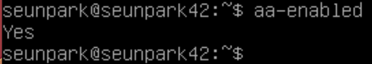

---
>아래 가이드를 따라하시면 설치가 완료되도록, 설치 순서대로 작성하였습니다. 

>해당 글이 치팅 시트로 변질됨을 방지하기 위해 <span style="color: red">중요부분을 삭제처리</span>하였으니, 직접 검색하고 알아보는 시간을 가지고 임해주시기 바랍니다.
>평가자분께선 피평가자가 이 사이트를 일반적인 수준 이상의 불필요한 참고 등 42서울 정신에 위배되는 행동을 하지 않는지 확인부탁드립니다.

---

# Vim설치, Apparmor 설정 확인하기

생성일: 2021년 9월 25일 오후 6:44

## Vim 설치?
```sudo apt-get install vim``

## AppArmor란?

---

- 시스템관리자가, 응용프로그램 역량 및 권한을 제한할 수 있도록 하는 커널 `보안 모듈`
- 프로그램의 `프로필`을 통해 아래와 같은 작업을 제한 및 관리함
    - 네트워크 엑세스
    - raw 소캣 엑세스
    - 파일 읽기, 쓰기, 실행 권한
    - 기타 해당 프로그램이 취할 수 있는 작업
- 강제적 접근 통제(MAC)를 제공함으로써 전통적인 유닉스 임의적 접근 통제 모델(DAC)을 지원
- CentOS와 같은 제품 및 파생제품은 SELinux, 다른 대부분은 APPArmor를 사용
- SELinux를 대체하는 한 부분으로서 제공
- APPArmor는 순전히 정책 파일을 기반으로 함
SELinux는 정책파일에 올바른 파일 시스템 레이블이 필요함

### DAC

- 임의접근제어, Discretionary Access Control
- 소유자가 사용자 또는 그룹이 자원에 접근하는 것을 조절

### MAC

- 강제접근제어, Mandatory Access Control
- 정의된 정책을 활용해 사용자와 프로세스의 행동으 제어

[접근 통제(Access Control) 와 DAC/MAC](https://www.lesstif.com/ws/access-control-dac-mac-43843837.html)

### AppArmor 프로필

- 프로필은 `/etc/apparmor.d` 디렉토리에 저장

### Mode

- 프로필은 complain mode와 enforce mode로 실행할 수 있음.
- Enforce mode:
응용프로그램이 제한된 동작을 수행하지 못하게 함.
- Complain mode:
응용프로그램을 제한하지 않고, 위반 사항을 보고하는 로그 항목만을 작성함.

## AppArmor 설정 확인하기

---

- apparmor가 기본으로 깔려있지만, 깔려있지 않다면 아래 명령어를 통해 설치

```bash
#apparmor설치 확인
sudo dpkg -l apparmor

#apparmor설치
sudo apt install apparmor

#apparmor utils 설치
sudo apt install apparmor-utils
```

- aa-enabled 명령어를 통해 활성화 여부 확인 가능
    
    
    

이하 자료는 아래 링크 참고

[VirtualBox Debian - AppArmor 프로필 생성](https://nostressdev.tistory.com/5)