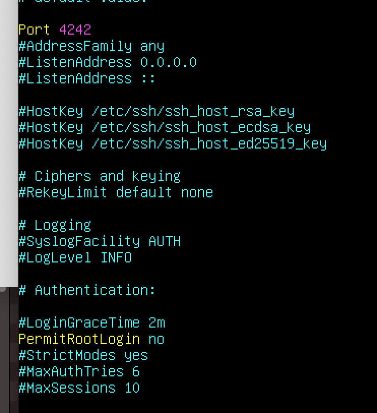
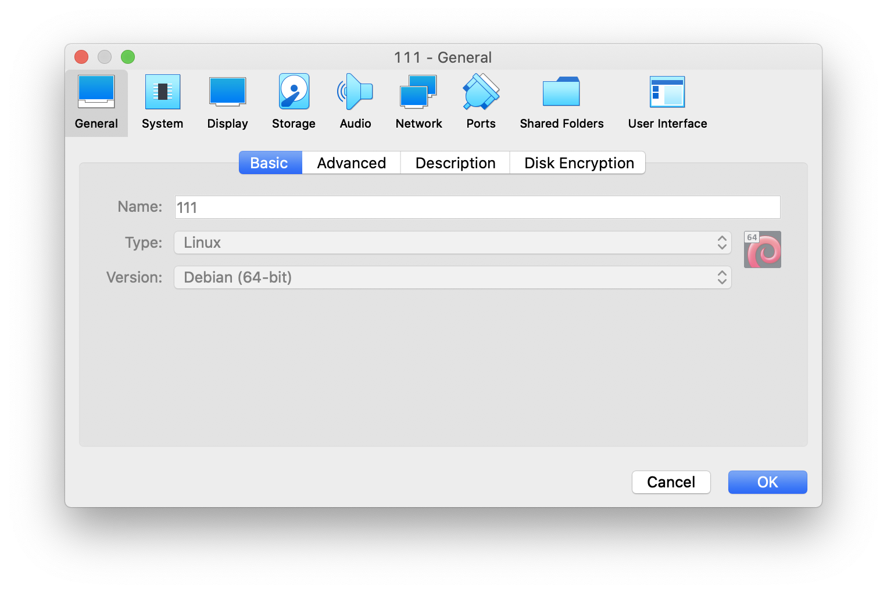
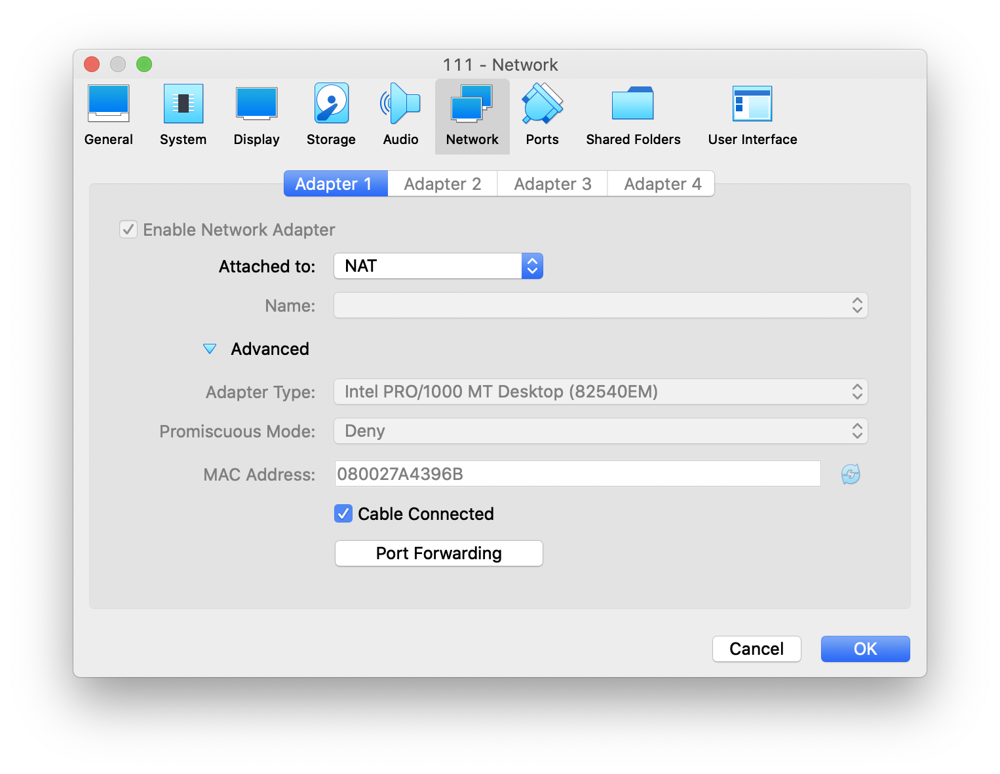
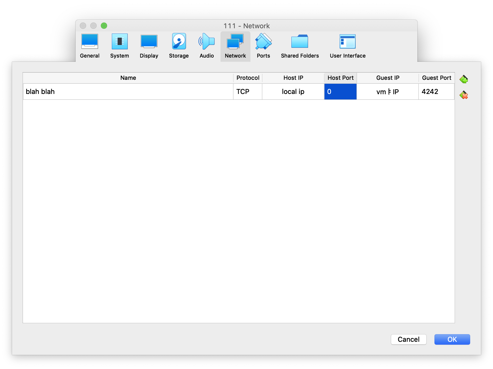

# SSH / SSH서버 설정하기

생성일: 2021년 7월 8일 오후 10:29

# SSH

---

### SSH

- Secure Shell Protocol
- 네트워크 프로토콜 중 하나로 컴퓨터와 컴퓨터가 인터넷과 같은 Public Network를 통해 서로 통신을 할 때 보안적으로 안전하게 통신하기 위해 사용하는 프로토콜
- 대표적인 사용의 예
    1. 데이터 전송 (깃 푸시)
    2. 원격제어 (aws같은 클라우드 서비스)
- FTP나 다른 프로토콜 말고 왜 SSH?
⇒ 보안

### private key / public key

- ssh는 다른 컴퓨터와 통신을 하기 위해 접속할 때, 우리가 일반적으로 사용하는 비밀번호의 입력을 통한 접속을 하지 않음
- 한 쌍의 KEY를 통해 접속하려는 컴퓨터와 인증 과정을 거치게 됨
- public key를 통해 메세지를 전송하기 전 암호화를 하게 됨. 복호화는 불가
- 절대로 외부에 노출되어서는 안되는 private key로 본인의 컴퓨터 내부에 저장되어 있고 이를 통해 복호화함

# SSH 설정하기

---

### 설정

- `apt search openssh-server` 명령어를 통해 openssh가 깔려있는지 확인.
    - 깔려있지 않다면, `apt install open ssh-server` 명령어로 설치
    - debian 설치 과정에서 잘 따라왔다면 설치되어 있음
- `systemctl status ssh` 명령어를 통해 openssh 실행여부와 사용 포트 확인
- `sudo vim /etc/ssh/sshd_config` 명령어를 통해 ssh설정을 변경
    - `Port 22`라 되어있는 줄에서 `22 ⇒ 4242`로 변경, 주석처리되어있다면 `#을 삭제`한다.
    
    /etc/ssh에는 `ssh_config`와 `sshd_config`가 있다. 전자는 `client`측일 때 설정, 후자는 `server`측일 때 설정이다.
    
- 아래 `PermitRootLogin` 부분을 `no`로 바꾼다.
해당 옵션을 통해 외부에서 root로 로그인하는 것을 막을 수 있다.
- `sudo systemctl restart ssh`로 재시작하여 설정 적용



### 로컬과 가상환경 간 ssh연결

- client(클러스터의 맥) 측에서 아래의 명령어를 입력한다.

```bash
ssh <계정 이름>@<서버주소> -p <포트번호>
#ssh seunpark@192.168.0.1 -p 4242
```

- 클러스터 환경이라면, 연결이 잘 되지 않을 것이다.
- Host OS인 맥의 IP로 접속하면 가상환경이 아닌 자기 자신으로 연결하는 것이 되어버린다.
- 포트 포워딩을 통해 연결할 수 있다.

- `ifconfig` 명령어를 통해 자신의 로컬 IP주소를 확인한다.
- `hostname -I (i 대문자)`를 통해 가상환경의 IP주소를 확인한다.
- VirtualBox에서 설정을 눌러 아래와 같은 창을 연다.



- 상단의 네비게이션에서 Network ⇒ Advanced ⇒ Port Forwarding 클릭



- 이름과 호스트와 게스트의 IP, Port를 입력한다.
    - HostIP는 로컬(클러스터 맥)의 IP, Guest IP는 가상머신의 IP를 입력한다.
    - Guest Port는 아까 열었던 4242로 설정한다.
    - Host Port의 경우 아무거나 입력하면 된다.
        - 단 다른 프로세스가 사용 중일 수 있으므로, `lsof -P -i :<원하는 번호>`로 포트번호 확인할 것.

