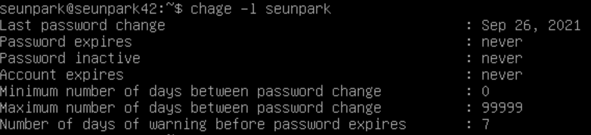

# 비밀번호 정책 설정

생성일: 2021년 9월 30일 오후 4:01

# 비밀번호 정책 설정

---

- 계정의 보안을 위해 암호 만료기간 등 정책을 설정할 수 있음

[[centOS] chage 명령어 상세분석](https://www.solgae.org/312)

<chage 명령어 설명>

### 정책 확인하기

- `chage -l <사용자>`를 통해 현재 사용자의 암호정보를 알 수 있다.
    
    
    

>chage명령은 계정의 암호와 사용기간을 관리하는 것이라 생각하면 편하다. 
>`암호만료일`을 통해 암호를 무한정 쓸지, 일정기간 계속 바꾸게 할지 정할 수 있다.
`계정만료일`이 지나면 그 이후 로그인을 할 수 없고, 관리자에게 연락해야 한다. 
>암호만료일 n일 전부터 암호변경을 요구하는 메세지를 알릴 수 있고, 암호만료 후 유예기간을 둘 수 있다.

### 기본정책 변경

- `chage` 명령어를 통해 아래와 같은 설정을 바꿀 수 있다.
    - `Last password change` (-d) : 마지막 패스워드 변경일
    - `Password expires` : 암호 만료일
    - `Password inactive`(-I (대문자i)) : 비활성화 유예기간
    - `Account expires`(-E) : 계정 만료일
    - `Minimum number ....` (-m) : 패스워드 변경 후 최소 사용 기간, 즉 최소 의무 사용일
    - `Maximum number ....` (-M) : 패스워드 변경 후 변경 없이 사용가능한 최대 일 수
    - `Number of days of warning ...` (-W) :  패스워드 만료 전 경고메세지를 보낼 일 수

- -M 옵션과 -m옵션, -W옵션을 통해 서브젝트에서 요구하는 패스워드 만료 관련 정책들을 변경한다. 
`sudo chage -M 30 -m 2 -W 7 <사용자이름>`
    
    
    

>계정이 만료되면 해당 계정의 cron작업이 수행되지 않는다.
[https://zetawiki.com/wiki/리눅스_패스워드_만료_안되게_하기](https://zetawiki.com/wiki/%EB%A6%AC%EB%88%85%EC%8A%A4_%ED%8C%A8%EC%8A%A4%EC%9B%8C%EB%93%9C_%EB%A7%8C%EB%A3%8C_%EC%95%88%EB%90%98%EA%B2%8C_%ED%95%98%EA%B8%B0)

### 전체 정책 변경

- 위 방법은 나의 계정만 정책을 변경시킴.
- 새로 만들어질 user에도 같은 정책이 적용되어야 함.
- `sudo vi /etc/login.defs` 에서 `PASS_MAX_DAY`, `PASS_MIN_DAYS`, `PASS_WARN_AGE`, `PASS_MIN_LEN` 을 서브젝트에 맞게 변경한다.

---

### 패스워드 정책 강도 설정

- `vi /etc/pam.d/common-password` 를 통해 현재 패스워드 정책을 확인할 수 있다.
    
    
    
- 패스워드 정책 설정을 위한 모듈을 설치하기 위해 아래의 명령어를 입력한다.
`sudo apt install libpam-cracklib`
- 패스워드정책 파일에 `pamcracklib.so`가 추가된 것을 볼 수 있다.
    
    
    
- `libpam-cracklib` 모듈을 통해 사용자가 입력한 암호를 시스템의 사전과 여러 규칙들로 패스워드 강도를 검사한다.
    - `retry=N` : 암호입력을 N회로 설정
    - `minlen=N` : 암호의 최소 길이는 N
    - `difok=N` : 기존 패스워드와 달라야하는 문자 수 N
    - `ucredit=-N` : 대문자 N개 이상 (N이 양수/음수인지 따라 뜻이 다름, 서브젝트 기준에 맞추어 음수로)
    - `lcredit=-N` : 소문자 N개 이상 (위와 동일)
    - `decredit=-N` : 숫자 N개 이상 (위와 동일)
    - `reject_username` : 사용자의 이름이 그대로 혹은 뒤집혀 패스워드에 있는지 검사
    - `enforce_for_root` : root사용자가 패스워드를 바꾸려 할 때에도 위 조건 적용
    - `maxrepeat=N` : 같은 문자가 N번 이상 연속해서 나오는지 검사

><>credit 명령어에서 N의 양수 음수 차이 
>(N >= 0)
새 패스워드에서 대문자로 얻을 수 있는 최대 점수. 대문자가 *`N`* 개 이하로 있으면 각 글자를 현재 `minlen` 값 검사에 +1씩 계산한다. `ucredit` 기본값은 *1*인데, 10보다 작은 `minlen`에 적당한 값이다. 
>(N < 0)
새 패스워드에 있어야 하는 대문자 최소 개수.

enforce_for_root

root에게는 이전 패스워드를 묻지 않으므로 이전 패스워드와 새 패스워드를 비교하는 검사를 수행하지 않는다. 따라서 별다른 작성 없이 서브젝트에서 요구하는 정책을 수행할 수 있다.

### 패스워드 변경

- 현재 비밀번호가 조건에 부합하지 않는 경우, 서브젝트 조건에 맞추어 새로 적용할 필요가 있다.
- 계정의 비밀번호는 `passwd -e <사용자명>` 으로 바꿀 수 있다.
    - 명령어를 입력한 후 logout한다.
    - 다시 로그인할 때 아래와 같이 비밀번호를 변경할 수  있다
        
        
        

### 기타옵션

[6.2. pam_cracklib - 사전의 단어들로 패스워드 검사](https://wariua.github.io/linux-pam-docs-ko/sag-pam_cracklib.html)