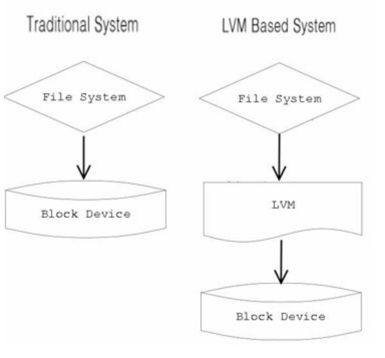

# 호스트네임과 파티셔닝

생성일: 2021년 9월 27일 오후 2:09

### 호스트네임

- `hostnamectl` 명령어를 통해 hostname을 확인할 수 있다.
- `sudo hostnamectl set-hostname <변경할 hostname>` 명령어를 통해 호스트명을 변경할 수 있다.

### LVM, 파티셔닝

- 파티션 확인은 `lsblk`명령어를 통해 확인할 수 있다.

[lvm 이란 매우 쉽게!](https://mamu2830.blogspot.com/2019/12/lvmpv-vg-lv-pe-lvm.html)

” Logical Volume을 효율적이고 유연하게 관리하기 위한 커널의 한 부분이자 프로그램”

LVM은 물리적 스토리지 이상의 추상적 레이어를 생성하여 논리적 스토리지를 생성할 수 있게 해줌

### 파티션과 차이

- 파티션
어떤 하나의 무언가를 여러개로 나누는 개념
- LVM
여러 디스크 공간, 짜투리 공간을 합쳐서 하나로 `만든` 것

### Why LVM?

1. 여러 디스크 공간을 합쳐서 하나인 양 사용하기 위해
2. 사용하기 애매한 공간의 디시크 파티션들을 활용하기 위해
3. 기존에 사용중인 디스크의 공간을 확장할 수 있기에

서버를 운영할 때 자주 쓰이는 리눅스의 경우, 갑자기 서버 인기가 많아져 확장을 해야 한다거나, 일일이 모든 내용을 백업하고 교체하는 것은 매우 비효율적이다.

## PV, PE

PV ⇒ 기존의 디스크 공간과 별 차이없는 `물리적 공간`

차이점

- LVM에서 사용하기 위한 개념
- PV의 최소 단위를 `PE`라고 부르며, `PE`로 전체 공간을 나누었다는 것

PE ⇒ 물리적 공간

- 기본사이즈 : 4MB (변경 가능)ㅌ

`PV를 만드는 이유 : LV를 만들기 쉽게, 디스크 최소 공간들을 PE로 통일하는 과정`

## VG

- volume group
- PV들을 합쳐서 VG을 만듬

## LV, LE

- logical volume, logical extent
- VG에서 필요에 따라 LV를 만들어 사용.
- LE는 PE가 logical volume에서 사용하는 것이니 이름이 LE로 바뀐 것 그뿐.