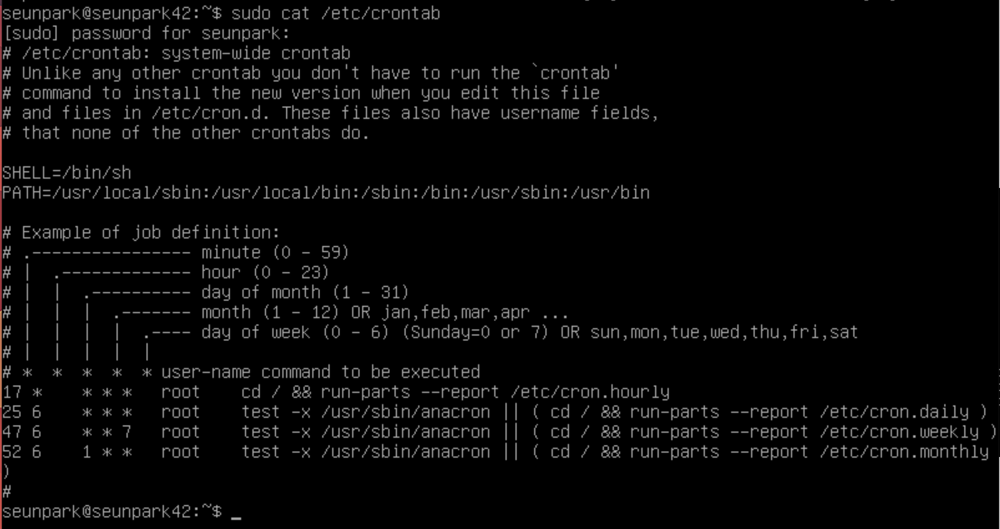

# cron_monitoring.sh

생성일: 2021년 9월 6일 오전 9:47

[[Linux]작업 예약 스케줄러(크론Cron)파일,자동 백업 명령 & 관련 문제](https://jhnyang.tistory.com/68)

# cron

---

### cron

- 특정한 시간에 or 특정 시간마다 어떤 작업을 자동으로 수행하게 하는 명령어

### crontab

- cron작업을 설정하는 파일
- cron프로세스는 `/etc/crontab` 파일에 설정된 것을 읽어 작업을 수행

### /usr/sbin/anacron

- 크론과 같이 동작하는 프로그램으로 서버가 일정시간 중지되었을 때에도 작업이 실행되는 것을 보장하기 위해 사용하는 도구

### /etc/cron.daily  /etc/cron.weekly   /etc/cron.monthly

- 시스템크론설정 디렉토리, cron은 주기적으로 실행할 내용을 시스템크론설정디렉토리에 넣어 작동시킴.

### /var/log/cron

- 크론 실행내용이 기록

# Monitoring.sh

---

### 운영체제 및 커널 버전의 아키텍처

- uname 명령어를 통해 시스템의 정보를 출력
    - -a : p와 i 옵션을 제외한 모든 정보 출력
    - -s : 커널 이름 출력
    - -n : 네트워크 의 호스트
    - -r : 커널의 릴리즈 정보
    - -v : 커널의 버전 출력
    - -m : 시스템의 하드웨어 타입 출력(아키텍처)
    - -p : 프로세스 종류 출력
    - -o : 운영체제 이름 출력
    - -i : 하드웨어 플랫폼 정보 출력
        - uname -ovms

[[Linux] uname 명령어에 대한 설명](https://udpark.tistory.com/99)

### 물리적 프로세서의 수

- `nproc` 명령어와 옵션를 사용하여 리눅스에서 사용가능한 프로세스의 수 출력

[How to check how many CPUs are there in Linux system](https://www.cyberciti.biz/faq/check-how-many-cpus-are-there-in-linux-system/)

### 가상 프로세서 개수

- 많은 검색 결과 물리프로세서는 코어 수, 가상 프로세서는 쓰레드 수를 의미하는듯, 우리 맥은 6코어 6쓰레드

~~삭제~~

[How to Display the Number of Processors (vCPU) on Linux VPS](https://webhostinggeeks.com/howto/how-to-display-the-number-of-processors-vcpu-on-linux-vps/)

### 서버에서 현재 사용 가능한 RAM 및 사용률(백분율)

- `free`명령어는 리눅스 시스템에서 메모리의 전체적인 현황을 살펴볼 수 있는 명령어임
- -m 옵션으로 메가바

- `-m` 옵션을 통해 MB로 단위 변경
- `awk`를 사용하여 적절한 값 도출

~~삭제~~

[How to get the percentage of memory free with a Linux command?](https://stackoverflow.com/questions/10585978/how-to-get-the-percentage-of-memory-free-with-a-linux-command)

### 서버에서 현재 사용 가능한 메모리 및 사용률(백분율)

- `df` 명령어를 통해 리눅스 내 디스크메모리 전체 현황 확인 가능
- `-m` 옵션을 통해 MB로 단위 변경
- `awk`를 사용하여 적절한 값 도출

~~삭제~~

### Cpu 사용량

- `top`명령어나 `cat /proc/stat` 등을 통해 CPU 사용량을 알 수 있음. 그러나 파싱하기 힘들고 특히 후자의 경우 부팅 후 모든 코어의 전체 CPU 사용량임.
- `sysstat`를 다운받아 `mpstat 명령어`를 사용하면 쉽게  현재 CPU의 사용량을 알 수 있음.
`sudo apt-get install sysstat`

간혹 `Temporary failure resolving 'deb.debian.org'` 에러코드와 함께 설치되지 않을 수 있음. 이는 DNS주소와 관련된 문제로, UFW 페이지에서 실행한 `DHCP 끄기설정을 원상복구`시키면 해결됨.

- `mpstat` 명령어에서 마지막 컬럼을 활용하여 결과를 도출

~~삭제~~

### 마지막 부팅날짜 및 시간

- `last reboot` 명령어를 사용하면 마지막으로 재기동한 시간이 언제인지 desc 정렬하여 출력한다.
- `who` 명령어는 현재 내가 어떤 사용자로 접속을 했는지 확인하기 위해 사용할 수 있다.
    - `-b` 옵션을 사용하면 마지막 시스템 부팅 시간을 출력한다는 뜻.
- 예시와 가장 비슷한 who명령어를 사용하였음.

~~삭제~~

### LVM이 활성 상태인지 여부

- `lsblk` 명령어를 사용하면 현재 장착된 디스크의 주요 사양을 확인할 수 있다.

~~삭제~~

### 활성 연결 수

- `ss`명령어를 사용하면 네트워크 상태를 확인할 수 있다.

~~삭제~~

### IP주소 확인

~~삭제~~

### mac주소 확인

- `ip link show` 명령어를 입력하면 mac주소를 얻을 수 있다.

~~삭제~~

### sudo 프로그램 실행된 명령 수

- `usermod -aG systemd-journal <사용자이름>` 명령어를 통해 `journalctl` 명령어를 사용할 준비
- journalctl을 사용하면 `systemd-journald` 데몬이 수집한 모든 로그 정보를 볼 수 있다.
- journalctl을 사용하여 특정 로그를 보고싶다면 `_COMM=<특정>` 옵션을 추가하면 된다.

~~삭제~~

 

# cron 작성

---

- `ps -ef | grep cron` 명령어를 통해 설치 여부 확인
출력이 있다면 설치되어 있음.
- `sudo crontab -e` 명령어를 통해 cron job을 등록할 수 있다.

~~삭제~~

~~삭제~~